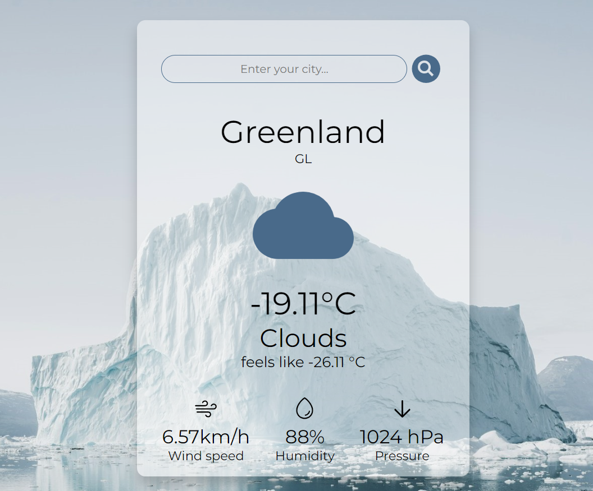

# Weather App

Приложение разработано для предоставления пользователям точных и актуальных данных о погоде в реальном времени. Предоставляет данные о текущей температуре воздуха, уровне влажности, скорости ветра и уровне атмосферного давления.

<br />
Link: https://currentweatherdata.netlify.app/

## Technologies Used

- Typescript
- React
- SCSS (Sass)
- OpenWeatherMap API
- Jest
- React Testing Library

## Preview



## Features

- Отображение текущей погоды в городе пользователя при предоставлении разрешения для определения геолокации
- Поиск данных о погоде в других городах
- Визуализация текущей погоды
- Отображение температуры в выбранном городе
- Отображение ощущаемой температуры
- Отображение данных о скорости ветра, уровне влажности воздуха и уровне атмосферного давления

## Purpose & Outcome

- Необходимо было создать интуитивный интерфейс, который бы адаптировался к различным устройствам и экранам.

Решение: с использованием SCSS создан адаптивный дизайн, обеспечивший беспроблемное использование приложения на мобильных устройствах и десктопах, что значительно улучшило опыт взаимодействия с приложением по отзывам пользователей.

- Требовалось обеспечить стабильную работу приложения за счет тестирования ключевых компонентов.

Решение: Применение Jest и React Testing Library обеспечило 90% покрытия тестами, что повысило стабильность и надежность приложения в реальных условиях эксплуатации.

## How to start project

in the project directory enter:

```js
npm install
```

and then

```js
npm run dev
```
