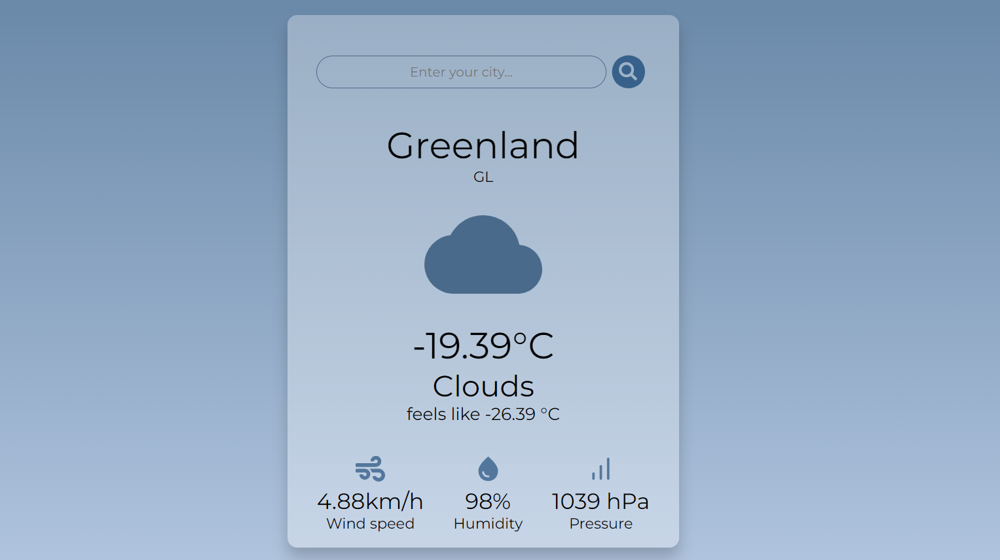

# Weather App

Приложение погоды.

[Deploy](https://tatyanazakiryanova.github.io/Weather-App/)



## Technologies Used

- Typescript
- React
- SCSS (Sass)
- OpenWeatherMap API
- Jest
- React Testing Library

## Features

- Отображение погоды при предоставлении разрешения для определения геолокации
- Поиск данных о погоде в других городах
- Отображение данных о температуре, скорости ветра, уровне влажности воздуха, уровне атмосферного давления

## More details

### Loading & Error Handling

- Спиннер при загрузке
- Сообщение "No weather data found" при ошибке или пустом запросе

### Styling and Responsiveness

- Адаптивная вёрстка до 360px ширины экрана (SCSS модули)
- React-icons для визуализации погоды

### Testing

- 90% покрытие тестами с Jest и React Testing Library

## How to start project

in the project directory enter:

```js
npm install
```

and then run in dev mode:

```js
npm run dev
```

build the project:

```js
npm run build
```

production mode:

```js
npm run preview
```
